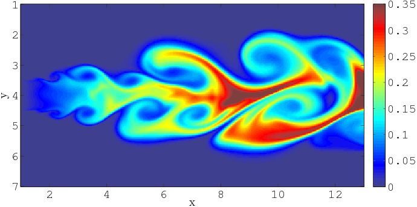

# TD simulation équation de transport

les équations de transport sont omniprésentes dans tous les domaines de la simulation numérique. Elles permettent par exemple de simuler la dispersion d'une espèce chimique dans une phase gaz, et comme celle d'un polluant dans l'atmosphère. Elles sont donc au coeur de très nombreux travaux de R&D passés ou actuels.

*Transport d'une espèce chimique dans un champ turbulent (source O. Emre et al.)*

## Equation d'advection scalaire

Dans le cadre de ce TP, nous focaliserons sur une équation d'advection scalaire de la forme :
$$ \partial_t u+a \partial_x u = 0$$

avec a > 0.

Pour simplifier les développement, nous nous restreindrons à une résolution en une dimension de l'espace.
Pour discrétiser cette équation, nous introduisons une grille 1-D de pas $\Delta x$, éventuellement variable, en espace, et une discrétisation uniforme, de pas $\Delta t$ en temps. Nous résolverons cette équation avec une méthode d'Euler en temps et deux schémas numériques en espace :

- le schéma décentré amont :
$$u^{n+1}_i = u^n_i-a\frac{\Delta t}{\Delta x} (u^n_i - u^n_{i-1})$$
- le schéma de Lax-Wendroff :
$$u^{n+1}_i = u^n_i-a\frac{\Delta t}{2\Delta x} (u^n_{i+1} - u^n_{i-1}) + a^2 \frac{\Delta t^2}{2\Delta x^2}(u^n_{i+1}-2u^n_i+u^n_{i-1})$$

Ces schémas sont tous les deux d'ordre un en temps. Le schéma décentré amont est d'ordre un en espace ; celui de Lax-Wendroff d'ordre deux.
Nous définissons le nombre CFL pour ces schémas :
$$CFL = a\frac{\Delta t}{\Delta x}$$
Pour que ces schémas soient stables, il faut s'assurer que $CFL <=1$. Dans notre étude nous prendrons $CFL = 0.5$.

## Objectifs du TP

L'objectif du TP n'est pas la seule construction d'un simulateur de cette équation d'advection. Il s'agit de mettre en oeuvre les concepts orientés objets vus en cours dans le contexte d'une application calcul scientifique.
Vous serez donc guidés, au fil des séances 2 à 5, pour construire l'architecture de cette application orienté objet. Nous suivrons les étapes suivantes :

- TD2 : création de l'architecture du simulateur (classes de base) ;
- TD3 : implémentation de la discrétisation d'une équation d'advection linéaire 1D ;
- TD4 : validation des résultats et parallélisation ;
- TD5 : extension du parallélisme pour la portabilité des performances.
