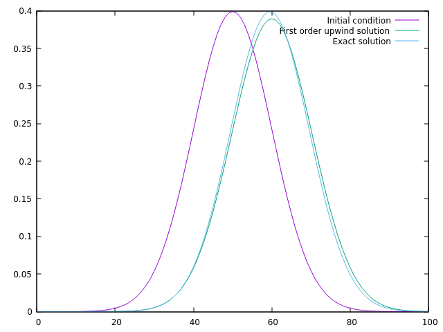
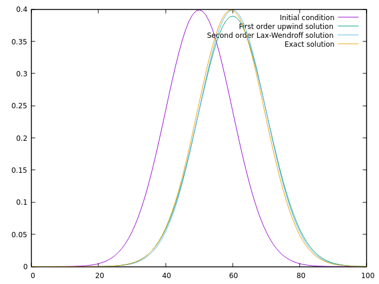

# TD 2 à 5 simulation équation de transport : résolution d'équation d'advection linéaire

Contexte et objectifs du TD : voir [Intro TD simulation équation d'advection](TD2-5_intro.md)

# TD 4 Validation des résultats

## 4.1 Calcul de la solution exacte

L'équation d'advection linéaire à coefficient constant que nous étudions dans ces TDs, pour rappel :

$\partial_t u+a \partial_x u = 0$,

admet une solution exacte. Nous allons donc pouvoir l'utiliser pour vérifier nos résultats.
Pour calculer la solution exacte, vous créerez une nouvelle méthode `Equation::compute_exact_solution`. Cette fonction pourra prendre en argument un objet `Variable`, le maillage `IMesh` et le temps courant. Elle devra calculer la solution exacte en chaque point d'espace du maillage. Vous pourrez appeler cette fonction au sein de votre boucle en temps pour calculer la solution exacte à chaque pas de temps. La solution exacte est de la forme

$u_{exacte}(x,t) = u_{initiale}(x-at)$,

la condition initiale étant simplement translatée à vitesse constante. La condition initiale de notre problème étant une gaussienne $f(x)$, cf. TD3, votre solution exacte sera simplement $u_{exacte}(x,t) = f(x-at)$. Vous stockerez la solution exacte dans une nouvelle variable `u_ref` (uniquement au temps courant).

## 4.2 Validation : affichage des résultats

Tout d'abord afin de pouvoir vous y retrouver lors de l'affichage des variables, vous ajouterez un champ `m_name` dans la classe `Variable`.
Ajoutez à votre classe `Variable` une méthode `print` qui vous permette d'afficher à l'écran les valeurs de votre variable ainsi que son nom. Vous appellerez cette méthode à la fin de chaque itération de `Problem::solve` pour les variables `u_np1` et `u_ref`. Les valeurs de `u_np1` et `u_ref` doivent correspondre.

Afin de pouvoir tracer votre solution et la solution exacte sur un graphique (avec gnuplot par exemple), vous ajouterez dans la méthode `print` un export dans un fichier, en utilisant par exemple un `std::ofstream`. La méthode `print` prendra maintenant un entier en argument afin de pouvoir indexer le fichier par le numéro de l'itération. Vous devez créer des fichiers avec le nom : 'Variable_u_np1_0.data', 'Variable_u_np1_1.data'...

## 4.3 Validation : comparaison des résultats

Afin de valider les résultats plus précisément, nous allons maintenant faire la simulation sur un plus grand nombre de points. Voici les nouveaux paramètres du calcul :

- `t_ini` = 0
- `t_final` = 2
- `dt` = 0.1
- `x_min` = 0
- `x_max` = 10
- `dx` = 0.1

L'objectif est maintenant de tracer sur une même courbe l'évolution de votre solution `u_n` et celle de la solution exacte `u_ref`. Vous exporterez dans un fichier la condition initiale (`u_n` au temps 0) ainsi que `u_n` et `u_ref` au temps final. Vous tracerez, avec gnuplot par exemple, la courbe d'évolution de ces deux variables en fonction du temps, pour obtenir une figure du type de celle ci-dessous:


## 4.4 Bonus

### 4.4.1 Comparaison entre l'ordre 1 et l'ordre 2

Si vous avez ajouté le schéma de Lax-Wendroff (bonus du TD3), vous allez maintenant pouvoir l'ajouter à la courbe pour voir l'apport de l'ordre 2 en espace sur la précision des résultats. Vous calculerez dans deux nouvelles variables `u_n_2nd_order` et `u_np1_2nd_order` la solution pour ce nouveau schéma et vous l'exporterez dans un fichier en fin de calcul afin de pouvoir l'ajouter à la courbe de comparaison. Vous devriez obtenir une figure de ce type :


où nous voyons que l'ordre 2 offre une meilleure précision que l'ordre 1.

### 4.4.2 Utilisation des algorithmes de la STL

Afin de prévoir la future optimisation de votre code, il serait intéressant d'utiliser au maximum des algorithmes de la STL dans votre code à chaque fois que cela est possible. En effet la parallélisation de ces algorithmes est assez directe. Par exemple un algorithme de type :

```c++
#include <algorithm>
int main() {
    std::for_each(container.begin(),container.end(),[](auto current_element) {
      // your function
    });
}
```

se parallélise simplement avec la notion de contexte d'exécution :

```c++
#include <execution>
#include <algorithm>
int main() {
    std::for_each(std::execution::par,container.begin(),container.end(),[](auto current_element) {
      // your function
    });
}
```

Vous pourrez introduire des algorithmes STL dans les éléments suivants de votre code :

- méthode `Variable::print()`
- méthode `Equation::compute_initial_solution()`
- méthode `Equation::compute_exact_solution()`

Ces algorithmes pourront être parallélisés lors du prochain TD sur la performance.
